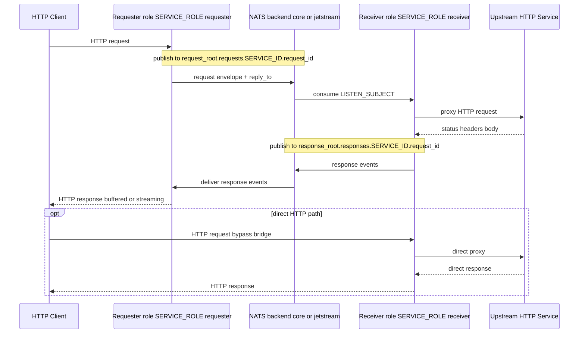
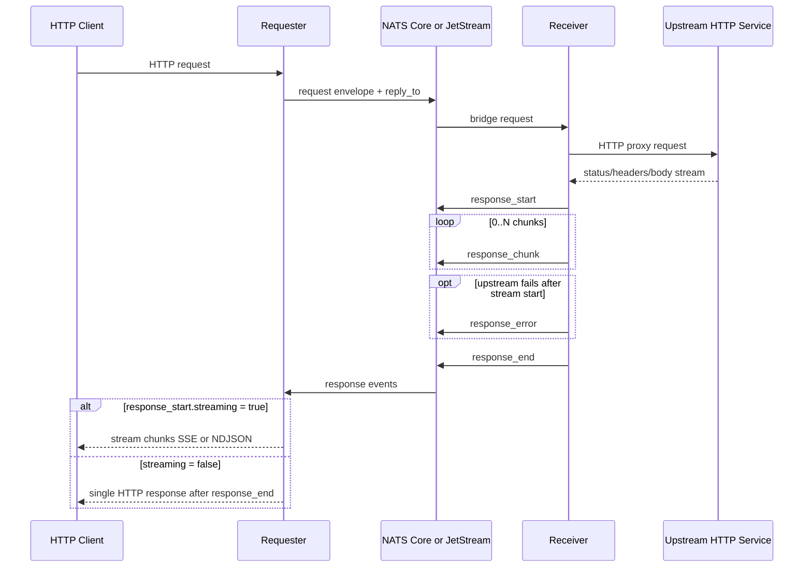

# HTTP-to-NATS Proxy Gateway

This service is a Ruby HTTP-to-NATS bridge.

Self NATS deployment docs:
- EN: [`src/docs/self-nats/README.md`](src/docs/self-nats/README.md)

One image supports two runtime roles:
- `requester`: accepts HTTP, publishes a request envelope to NATS, waits for response events, returns HTTP to the caller.
- `receiver`: consumes bridge requests from NATS, proxies them to `UPSTREAM_URL`, publishes response events, and also serves direct HTTP to the same upstream.

## Bridge flow

## Runtime model

### Role selection

- `SERVICE_ROLE=requester|receiver`
- If `SERVICE_ROLE` is not set, role resolves by topology: `receiver` when `UPSTREAM_URL` is set, otherwise `requester`.
- `requester` starts the response listener and downstream tunnel listener.
- `receiver` starts the request listener and upstream tunnel listener.

### Upstream requirement

- `receiver` requires `UPSTREAM_URL` for direct HTTP proxying and bridged request execution.
- In Core mode, missing upstream returns a bridged `503` response.
- In JetStream mode, missing upstream is treated as a retryable processing failure (`nak`).

## Transport modes

`NATS_MODE` is resolved once at startup and remains fixed for the process lifetime.

### `core`

- Uses Core NATS publish/subscribe.
- Receiver consumes via `LISTEN_SUBJECT` with queue group `NATS_QUEUE_GROUP`.
- Delivery semantics: best-effort at-most-once.

### `jetstream`

- Requires stream access on startup.
- Receiver consumes via durable pull consumer `NATS_CONSUMER_NAME`.
- Requester consumes response events via a response-scoped consumer derived from `SERVICE_ID`.
- Message outcomes:
  - success -> `ack`
  - malformed request envelope -> publish `400` bridge error when possible, then `term`
  - transient failure -> `nak`
  - long processing -> periodic `in_progress`

### `auto`

- Tries JetStream first by stream availability.
- Falls back to Core when JetStream is unavailable.
- Resolved backend is exposed in `/observability/nats` as `backend`.

## Subjects and protocol

### Subject roots

- Request root: `NATS_REQUEST_SUBJECT_ROOT`
- Response root: `NATS_RESPONSE_SUBJECT_ROOT`

Per-request subjects:
- request: `<request_root>.requests.<SERVICE_ID>.<request_id>`
- response: `<response_root>.responses.<SERVICE_ID>.<request_id>`
- cancel: same per-request request subject as request (`<request_root>.requests.<SERVICE_ID>.<request_id>`) with typed envelope `type=cancel`

`LISTEN_SUBJECT` defaults to `<request_root>.requests.>`.

### Response event protocol

Requester expects event-framed JSON only:
- `response_start`
- `response_chunk` (0..N)
- `response_error` (optional)
- `response_end`

`response_start` contains HTTP status, headers, content type, and `streaming` flag.

## HTTP behavior

### Requester path (HTTP -> NATS -> HTTP)

- Supports `GET`, `POST`, `PUT`, `PATCH`, `DELETE`, `OPTIONS`, `HEAD`.
- `GET` and `HEAD` keep `/`, `/health`, `/healthcheck`, and `/observability*` as local endpoints unless explicitly treated as proxy requests.
- Publishes request envelope with:
  - `request_id`
  - `method`
  - `path`
  - `headers`
  - `body`
  - `reply_to`

### Receiver direct path (HTTP -> Upstream)

- Supports the same HTTP methods.
- Reuses the same proxy and response protocol logic as NATS-delivered work.

### HTTP proxy, CONNECT, and SOCKS5

- HTTP proxy requests can target absolute URLs through the requester role.
- `CONNECT` is supported through bridged TCP sessions.
- SOCKS5 ingress is optional and enabled via `SOCKS5_ENABLED=true`.
- Proxy auth is controlled by `PROXY_AUTH_ENABLED` and `PROXY_AUTH_USERS_JSON`.

### Streaming and errors

- Streaming content types: `text/event-stream`, `application/x-ndjson`.
- Requester streaming mode is driven by `response_start.streaming`.
- Multi-value response headers are preserved, including repeated headers.
- If upstream fails after stream start:
  - SSE: `event: error`
  - NDJSON: `{"error":"..."}`
- If requester does not receive `response_start` within `NATS_RESPONSE_TIMEOUT`, it returns HTTP `504`.
- After `response_start`, `STREAM_RESPONSE_TIMEOUT` is enforced as an idle timeout between protocol events (`response_chunk`, `response_end`, `response_error`).
- If no next event arrives within `STREAM_RESPONSE_TIMEOUT` after `response_start`, requester ends by timeout. For streams this becomes an in-band timeout error; for non-stream responses it becomes HTTP `504`.

### Stream cancel propagation

An active streaming HTTP response that disconnects downstream is treated as a cancel for that request lifecycle. The requester publishes one typed cancel envelope to the same per-request request subject as the original bridge request. Message format: top-level `type=cancel`, `request_id`, and nested `cancel` object with JSON fields `request_id`, `service_id`, `reason`, `timestamp`.

Cancellation is best-effort, not a hard kill guarantee:
- duplicate or late cancel messages are ignored
- upstream work is interrupted only when the current upstream call can still observe the cancel check
- after cancel, at most one already-started `response_chunk` may slip through as a bounded tail

The terminal outcome is recorded as `canceled`, distinct from `completed`, `timeout`, `upstream_error`, and `protocol_error`.

## Key configuration

| Variable | Default | Purpose |
|---|---|---|
| `SERVICE_ROLE` | `receiver` if `UPSTREAM_URL` is set, else `requester` | `requester` or `receiver` |
| `UPSTREAM_URL` | — | Upstream HTTP base URL for receiver role |
| `NATS_URL` | `nats://localhost:4222` | NATS server URL |
| `NATS_MODE` | `auto` | `core`, `jetstream`, or `auto` |
| `NATS_STREAM` | `proxy` | JetStream stream name |
| `NATS_CONSUMER_NAME` | `nats-proxy` | Receiver durable consumer name |
| `NATS_QUEUE_GROUP` | `NATS_CONSUMER_NAME` | Core receiver queue group |
| `NATS_REQUEST_SUBJECT_ROOT` | `to.proxy` | Request subject root |
| `NATS_RESPONSE_SUBJECT_ROOT` | `from.proxy` | Response subject root |
| `LISTEN_SUBJECT` | `<request_root>.requests.>` | Receiver subscription scope |
| `SERVICE_ID` | `srv-<random>` | Instance identifier |
| `NATS_RESPONSE_TIMEOUT` | `30` | Timeout waiting for the first `response_start` |
| `STREAM_RESPONSE_TIMEOUT` | `30` | Idle timeout between events after `response_start` |
| `RECEIVER_MAX_INFLIGHT` | `20` | Receiver async dispatcher max concurrent jobs |
| `NATS_JS_API_PREFIX` | — | Optional JetStream API prefix |
| `SOCKS5_ENABLED` | `false` | Enables the local SOCKS5 server for bridged TCP sessions |
| `SOCKS5_LISTEN_HOST` | `0.0.0.0` | SOCKS5 bind host |
| `SOCKS5_LISTEN_PORT` | `1080` | SOCKS5 bind port |
| `PROXY_AUTH_ENABLED` | `true` | Enables HTTP proxy and SOCKS5 authentication guard |
| `PROXY_AUTH_USERS_JSON` | — | JSON object of username to bcrypt hash |

## Observability

Local observability endpoints:
- `GET /observability` (UI)
- `GET /observability/flows`
- `GET /observability/cases`
- `GET /observability/metrics`
- `GET /observability/nats`
