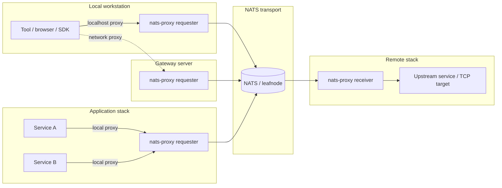
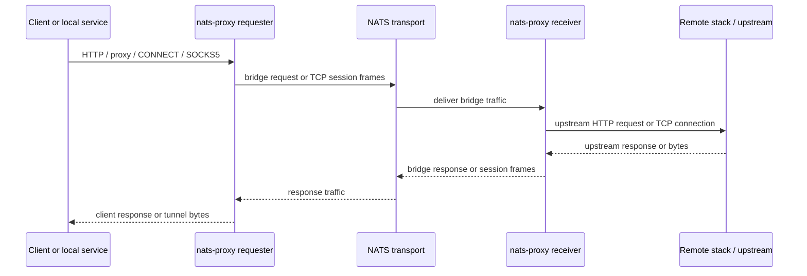

# nats-proxy

`nats-proxy` is a Ruby proxy gateway that moves HTTP and TCP proxy traffic through NATS.

The service is built for split-network deployments where the caller can reach a local proxy, the target service is reachable only from another node, and the two sides can communicate through NATS. One container image runs in one of two roles:

| Role | Responsibility |
|---|---|
| `requester` | Accepts local HTTP, HTTP proxy, `CONNECT`, and optional SOCKS5 traffic, publishes bridge requests to NATS, and reconstructs responses for the client. |
| `receiver` | Consumes bridge requests from NATS, connects to `UPSTREAM_URL` or a requested TCP target, and publishes response/session events back to the requester. |

Detailed documentation: <https://artyomb.github.io/nats-proxy/>

---

## Concept

The core idea is a role-based proxy bridge. The requester is placed close to clients or local services. The receiver is placed close to the upstream system. The only required path between the two sides is NATS.

Common requester placement options:



Traffic always follows the same high-level path after it reaches requester:



> [!NOTE]
> The deployment can use a shared external NATS server, or the image can start an embedded `nats-server` and connect two sides with NATS leafnodes.

---

## Traffic Patterns

`nats-proxy` currently supports these ingress patterns on the requester side:

- Plain HTTP forwarding: client sends HTTP to requester; receiver forwards to `UPSTREAM_URL`.
- HTTP proxy forwarding: client sends absolute-form proxy requests through requester.
- HTTP `CONNECT`: requester opens a bridged TCP session through NATS.
- SOCKS5: optional requester listener that maps SOCKS5 `CONNECT` to the same TCP session bridge.
- Streaming HTTP responses: SSE and NDJSON responses are forwarded as streams.

---

## Capabilities

- Core NATS and JetStream backends.
- Binary-safe chunk transport using base64 when a response chunk is not valid UTF-8.
- Best-effort stream cancellation when the downstream client disconnects.
- Local observability UI and JSON APIs for flows, cases, metrics, and NATS runtime state.
- Optional proxy authentication with bcrypt-hashed users for proxy-specific ingress.

---

## Runtime Roles

### requester

The requester is the client-facing side.

It starts:

- response listener for per-request bridge responses;
- downstream session listener for TCP tunnel bytes;
- SOCKS5 listener when `SOCKS5_ENABLED=true`.

For regular HTTP routes, it publishes a bridge request if NATS outbound listening is ready. If the process also has `UPSTREAM_URL`, it can fall back to direct upstream execution.

### receiver

The receiver is the upstream-facing side.

It starts:

- request listener on `LISTEN_SUBJECT`;
- upstream session listener for TCP tunnel bytes;
- handlers for `http_request` and `tcp_stream` operations.

When the receiver is accessed directly over HTTP and `UPSTREAM_URL` is configured, it proxies directly to the upstream without using NATS.

If `SERVICE_ROLE` is not set, the service chooses `receiver` when `UPSTREAM_URL` is present and `requester` otherwise.

---

## NATS Transport

The service can run on Core NATS or JetStream:

| Mode | Summary |
|---|---|
| `core` | Pub/sub transport with receiver queue groups. |
| `jetstream` | Persistent stream transport with pull consumers and explicit acknowledgements. |
| `auto` | Startup-time backend detection based on stream availability. |

For embedded deployments, the runtime image can start `nats-server` inside the container and generate a leafnode configuration from environment variables. For external deployments, point both roles at an existing NATS topology with `NATS_URL`.

---

## Proxy Authentication

Proxy authentication is enabled by default for proxy-specific ingress:

- absolute-form HTTP proxy requests;
- legacy proxy requests detected by proxy headers;
- `CONNECT`;
- SOCKS5 when enabled.

Local observability and health routes are not proxy-authenticated.

`PROXY_AUTH_USERS_JSON` must be a JSON object where keys are usernames and values are bcrypt hashes:

```json
{"alice":"$2a$12$..."}
```

If proxy auth is enabled and the users JSON is missing or invalid, the service enters a safety lock and denies proxy-specific traffic with a generic `404 Not Found`.

Set `PROXY_AUTH_ENABLED=false` to disable this guard.

---

## Observability

The service exposes local observability endpoints:

| Endpoint | Description |
|---|---|
| `GET /observability` | HTML UI for runtime health, NATS state, flow cases, and raw payload inspection. |
| `GET /observability/flows` | Event feed. Supports filters such as `request_id`, `subject`, `event_type`, `outcome`, `from`, `to`, `limit`, and `include_nats_payload`. |
| `GET /observability/cases` | Request/session case summaries reconstructed from recorded events. |
| `GET /observability/metrics` | RPS, error/cancel rates, and reconstruction quality for a bounded window. |
| `GET /observability/nats` | NATS connection snapshot and JetStream stream/consumer details when available. |
| `GET /healthcheck` | Health endpoint provided by the Rack service base. |

The in-memory observability collector keeps a bounded recent event history and is intended for local diagnosis, not long-term storage.

---

## Configuration

The variables below are the minimum set needed to understand and start the service.

| Variable | Default | Description |
|---|---|---|
| `SERVICE_ROLE` | `receiver` if `UPSTREAM_URL` is set, else `requester` | Runtime role: `requester` or `receiver`. |
| `UPSTREAM_URL` | unset | Receiver HTTP upstream base URL. |
| `PORT` | `7000` in the Docker image | Rack/Falcon bind port. |
| `NATS_URL` | `nats://localhost:4222` | NATS server URL used by the app process. |
| `NATS_MODE` | `auto` | `core`, `jetstream`, or `auto`. |
| `PROXY_AUTH_ENABLED` | `true` | Enables proxy auth guard for proxy-specific traffic. |
| `PROXY_AUTH_USERS_JSON` | unset | JSON map of username to bcrypt hash. |
| `SOCKS5_ENABLED` | `false` | Enables SOCKS5 listener on requester. |
| `EMBEDDED_NATS_ENABLED` | `false` | Starts embedded `nats-server` from the runtime image. |

---

## Quick Start

Build the runtime image and run a local smoke-test topology in Docker: one NATS server, one receiver, and one requester.

```bash
REGISTRY_HOST=nats-proxy-local docker-compose -f docker/docker-compose.yml build nats_proxy
```

```bash
docker network create nats-proxy
```

```bash
docker run -d \
  --name nats-proxy-nats \
  --network nats-proxy \
  nats:2.11-alpine
```

```bash
docker run -d \
  --name nats-proxy-receiver \
  --network nats-proxy \
  -p 7001:7000 \
  -e SERVICE_ROLE=receiver \
  -e SERVICE_ID=receiver-local \
  -e UPSTREAM_URL=http://example.com \
  -e NATS_URL=nats://nats-proxy-nats:4222 \
  -e NATS_MODE=core \
  -e NATS_RESPONSE_SUBJECT_ROOT=proxy \
  -e PROXY_AUTH_ENABLED=false \
  -e PORT=7000 \
  nats-proxy-local/nats-proxy
```

```bash
docker run -d \
  --name nats-proxy-requester \
  --network nats-proxy \
  -p 7000:7000 \
  -e SERVICE_ROLE=requester \
  -e SERVICE_ID=requester-local \
  -e NATS_URL=nats://nats-proxy-nats:4222 \
  -e NATS_MODE=core \
  -e NATS_RESPONSE_SUBJECT_ROOT=proxy \
  -e PROXY_AUTH_ENABLED=false \
  -e PORT=7000 \
  nats-proxy-local/nats-proxy
```

Verify the requester, receiver, and bridged request:

```bash
curl -fsS http://127.0.0.1:7000/healthcheck
curl -fsS http://127.0.0.1:7001/healthcheck
curl -sS http://127.0.0.1:7000/observability/nats
curl -i http://127.0.0.1:7000/
```

The final request reaches the requester on host port `7000`, crosses NATS, and returns the upstream HTTP response through the receiver.

Clean up the quick-start containers:

```bash
docker rm -f nats-proxy-requester nats-proxy-receiver nats-proxy-nats
docker network rm nats-proxy
```

Both service containers disable proxy auth in this smoke test. Production proxy ingress should configure `PROXY_AUTH_USERS_JSON` instead of using `PROXY_AUTH_ENABLED=false`.

---

## Development

The application code lives in [`src/`](src/). Main runtime files:

| File | Purpose |
|---|---|
| [`src/config.ru`](src/config.ru) | Rack/Sinatra entrypoint, environment config, routes, middlewares. |
| [`src/service_runtime.rb`](src/service_runtime.rb) | Boot composition and role-specific listener startup. |
| [`src/bridge_core.rb`](src/bridge_core.rb) | NATS request/response/session transport, dispatching, JetStream consumers. |
| [`src/bridge_protocol.rb`](src/bridge_protocol.rb) | Bridge event protocol helpers. |
| [`src/http_gateway.rb`](src/http_gateway.rb) | HTTP request conversion, upstream proxying, response rendering. |
| [`src/tcp_tunnel_bridge.rb`](src/tcp_tunnel_bridge.rb) | `CONNECT` and SOCKS5 TCP tunnel bridge. |
| [`src/socks5_server.rb`](src/socks5_server.rb) | SOCKS5 protocol handling. |
| [`src/proxy_auth.rb`](src/proxy_auth.rb) | Proxy auth and safety lock. |
| [`src/nats_async_runtime.rb`](src/nats_async_runtime.rb) | NATS client wrapper and backend resolution. |
| [`src/observability_collector.rb`](src/observability_collector.rb) | In-memory flow, case, metric, and NATS state payloads. |

Run tests from `src/`:

```bash
bundle exec rspec
bundle exec rake spec:unit
bundle exec rake spec:system
bundle exec rake spec:contracts
```

Some tests start local NATS/system helpers and require the bundled test dependencies from `Gemfile`.
