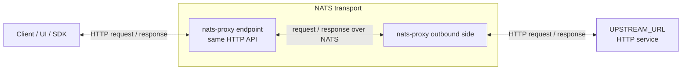
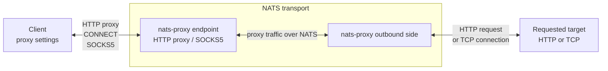

# nats-proxy

`nats-proxy` accepts regular HTTP/proxy requests from a client and carries them through NATS to another replica that performs the real outbound request.

It is useful when an application, SDK, browser, UI, or system proxy setting already knows how to talk HTTP, but you want NATS to be the transport between the client side and the required upstream. Instead of changing the client, you point it at a `nats-proxy` endpoint. The service accepts the request in its usual HTTP form, sends it through NATS to the upstream-facing side, that side performs an outbound HTTP request or opens a TCP connection, and the response returns through the same path.

The practical result is a bridge for software that does not natively speak NATS:

- Keep the same HTTP endpoint contract for the client.
- Move the actual request/response path through a NATS bus.
- Perform outbound requests from the upstream-facing side, where the required upstream or TCP target is reachable.
- Inspect recent requests, responses, stream events, tunnel sessions, and NATS runtime state from local observability endpoints.

Detailed documentation: <https://artyomb.github.io/nats-proxy/>

---

## Concept

The service has two main usage scenarios. They can be used separately or together.

### Remote HTTP Endpoint

In this scenario, `nats-proxy` stands in front of a concrete HTTP upstream.

A client calls the client-facing endpoint as if it was calling the upstream service. That endpoint sends the HTTP method, path, headers, and body through NATS. The upstream-facing side makes the real HTTP request to `UPSTREAM_URL` and sends the response back. For the client, the endpoint still behaves like a regular HTTP API.

This is the main fit when:

- the client cannot or should not be modified to use NATS;
- the upstream service is reachable only from another host;
- both sides can communicate through NATS;
- you want visibility into what is being sent to the upstream service.



### Network Proxy

In this scenario, `nats-proxy` is configured as a normal HTTP proxy or SOCKS5 proxy, but the proxy traffic itself still goes through the NATS bus.

The client uses standard proxy support: an HTTP proxy URL, an HTTP `CONNECT` tunnel, system proxy settings, or the optional SOCKS5 listener. The client-facing endpoint accepts that proxy traffic and forwards it through NATS to the upstream-facing side. That side then opens the requested HTTP or TCP connection.

This is the main fit when:

- the client already supports HTTP proxy or SOCKS5 settings;
- you need to route arbitrary HTTP destinations through the upstream-facing side;
- you need to send HTTP requests or TCP tunnels through the NATS bus;
- you still want local flow and runtime observability for proxied traffic.



### Two Ways to Run the Image

The same container image runs on both sides. The role only decides which side of the flow the container serves:

| Role | Responsibility |
|---|---|
| `requester` | Entry point for clients. Put this where applications, browsers, tools, or proxy settings can reach it. It accepts the client request and returns the final response. |
| `receiver` | Outbound side. Put this where the required `UPSTREAM_URL` or requested TCP target is reachable. It performs the real outbound request or connection. |

The client does not need to know about NATS. Between `requester` and `receiver`, the only required path is NATS.

> [!NOTE]
> The NATS bus can be an existing shared NATS deployment. The runtime image can also start an embedded `nats-server` when you want the two sides connected with NATS leafnodes.

---

## Traffic Patterns

Clients can use the `nats-proxy` endpoint in these ways:

- Direct HTTP: the client calls `nats-proxy` like the upstream API; the outbound side forwards to `UPSTREAM_URL`.
- HTTP proxy: the client configures `nats-proxy` as an HTTP proxy; proxy traffic crosses NATS before the outbound request is made.
- HTTP `CONNECT`: the client opens a TCP tunnel through `nats-proxy`; the outbound side connects to the requested host and port.
- SOCKS5: optional proxy listener with the same NATS-backed TCP tunnel behavior.
- Streaming HTTP responses: SSE and NDJSON responses are returned as streams.

---

## Capabilities

- Core NATS and JetStream backends.
- Binary-safe chunk transport using base64 when a response chunk is not valid UTF-8.
- Best-effort stream cancellation when the downstream client disconnects.
- Local observability UI and JSON APIs for flows, cases, metrics, and NATS runtime state.
- Optional proxy authentication with bcrypt-hashed users for HTTP proxy, `CONNECT`, and SOCKS5 traffic.

---

## Role Behavior

### requester

The requester is what clients talk to. It behaves like the service endpoint or proxy endpoint from the client's point of view.

In this role, the process:

- accepts direct HTTP requests, HTTP proxy requests, and HTTP `CONNECT`;
- optionally accepts SOCKS5 connections when `SOCKS5_ENABLED=true`;
- sends accepted work through NATS to the outbound side;
- waits for HTTP responses or tunnel bytes from NATS and returns them to the original client.

If the same process also has `UPSTREAM_URL`, it can execute regular HTTP requests directly as a local fallback.

### receiver

The receiver is what performs work on the other side of NATS. It is the part that makes outbound requests from its own network position.

In this role, the process:

- listens for requests and tunnel traffic from NATS;
- forwards direct HTTP requests to `UPSTREAM_URL`;
- opens requested TCP connections for HTTP `CONNECT` and SOCKS5 tunnels;
- sends HTTP responses or tunnel bytes back through NATS to the requester.

When the receiver is accessed directly over HTTP and `UPSTREAM_URL` is configured, it proxies directly to the upstream without using NATS.

If `SERVICE_ROLE` is not set, the service chooses `receiver` when `UPSTREAM_URL` is present and `requester` otherwise.

---

## NATS Transport

The service can run on Core NATS or JetStream:

| Mode | Summary |
|---|---|
| `core` | Pub/sub transport with receiver queue groups. |
| `jetstream` | Persistent stream transport with pull consumers and explicit acknowledgements. |
| `auto` | Startup-time backend detection based on stream availability. |

For embedded deployments, the runtime image can start `nats-server` inside the container and generate a leafnode configuration from environment variables. For external deployments, point both roles at an existing NATS topology with `NATS_URL`.

---

## Proxy Authentication

Proxy authentication is enabled by default for proxy entry points:

- absolute-form HTTP proxy requests;
- legacy proxy requests detected by proxy headers;
- `CONNECT`;
- SOCKS5 when enabled.

Local observability and health routes are not proxy-authenticated.

`PROXY_AUTH_USERS_JSON` must be a JSON object where keys are usernames and values are bcrypt hashes:

```json
{"alice":"$2a$12$..."}
```

If proxy auth is enabled and the users JSON is missing or invalid, the service enters a safety lock and denies proxy-specific traffic with a generic `404 Not Found`.

Set `PROXY_AUTH_ENABLED=false` to disable this guard.

---

## Observability

The service exposes local observability endpoints:

| Endpoint | Description |
|---|---|
| `GET /observability` | HTML UI for runtime health, NATS state, flow cases, and raw payload inspection. |
| `GET /observability/flows` | Event feed. Supports filters such as `request_id`, `subject`, `event_type`, `outcome`, `from`, `to`, `limit`, and `include_nats_payload`. |
| `GET /observability/cases` | Request/session case summaries reconstructed from recorded events. |
| `GET /observability/metrics` | RPS, error/cancel rates, and reconstruction quality for a bounded window. |
| `GET /observability/nats` | NATS connection snapshot and JetStream stream/consumer details when available. |
| `GET /healthcheck` | Health endpoint provided by the Rack service base. |

The in-memory observability collector keeps a bounded recent event history and is intended for local diagnosis, not long-term storage.

---

## Configuration

The variables below are the minimum set needed to understand and start the service.

| Variable | Default | Description |
|---|---|---|
| `SERVICE_ROLE` | `receiver` if `UPSTREAM_URL` is set, else `requester` | Runtime role: `requester` or `receiver`. |
| `UPSTREAM_URL` | unset | Receiver HTTP upstream base URL. |
| `PORT` | `7000` in the Docker image | Rack/Falcon bind port. |
| `NATS_URL` | `nats://localhost:4222` | NATS server URL used by the app process. |
| `NATS_MODE` | `auto` | `core`, `jetstream`, or `auto`. |
| `PROXY_AUTH_ENABLED` | `true` | Enables proxy auth guard for proxy-specific traffic. |
| `PROXY_AUTH_USERS_JSON` | unset | JSON map of username to bcrypt hash. |
| `SOCKS5_ENABLED` | `false` | Enables SOCKS5 listener on requester. |
| `EMBEDDED_NATS_ENABLED` | `false` | Starts embedded `nats-server` from the runtime image. |

---

## Quick Start

Build the runtime image and run a local working topology in Docker: one NATS server, one receiver, and one requester.

```bash
REGISTRY_HOST=nats-proxy-local docker-compose -f docker/docker-compose.yml build nats_proxy
```

```bash
docker network create nats-proxy
```

```bash
docker run -d \
  --name nats-proxy-nats \
  --network nats-proxy \
  nats:2.11-alpine
```

The receiver uses `UPSTREAM_URL=http://example.com` only as a quick-start target. Replace it with the HTTP service you want the receiver side to call.

```bash
docker run -d \
  --name nats-proxy-receiver \
  --network nats-proxy \
  -p 7001:7000 \
  -e SERVICE_ROLE=receiver \
  -e SERVICE_ID=receiver-local \
  -e UPSTREAM_URL=http://example.com \
  -e NATS_URL=nats://nats-proxy-nats:4222 \
  -e NATS_MODE=core \
  -e NATS_RESPONSE_SUBJECT_ROOT=proxy \
  -e PROXY_AUTH_ENABLED=false \
  -e PORT=7000 \
  nats-proxy-local/nats-proxy
```

```bash
docker run -d \
  --name nats-proxy-requester \
  --network nats-proxy \
  -p 7000:7000 \
  -e SERVICE_ROLE=requester \
  -e SERVICE_ID=requester-local \
  -e NATS_URL=nats://nats-proxy-nats:4222 \
  -e NATS_MODE=core \
  -e NATS_RESPONSE_SUBJECT_ROOT=proxy \
  -e PROXY_AUTH_ENABLED=false \
  -e PORT=7000 \
  nats-proxy-local/nats-proxy
```

Verify the requester, receiver, and bridged request:

```bash
curl -fsS http://127.0.0.1:7000/healthcheck
curl -fsS http://127.0.0.1:7001/healthcheck
curl -sS http://127.0.0.1:7000/observability/nats
curl -i http://127.0.0.1:7000/
```

The final request reaches the requester on host port `7000`, crosses NATS, and returns the upstream HTTP response through the receiver.

Clean up the quick-start containers:

```bash
docker rm -f nats-proxy-requester nats-proxy-receiver nats-proxy-nats
```

```bash
docker network rm nats-proxy
```

Both service containers disable proxy auth for this quick local run. Production proxy ingress should configure `PROXY_AUTH_USERS_JSON` instead of using `PROXY_AUTH_ENABLED=false`.

