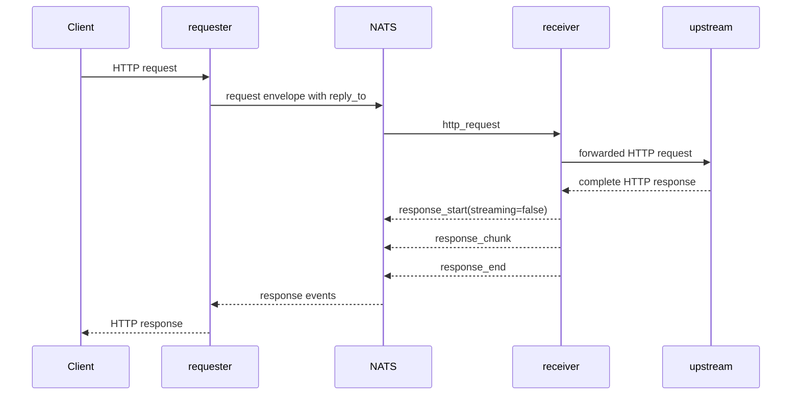
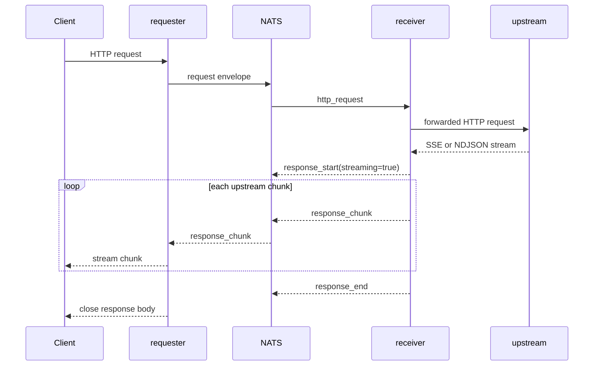
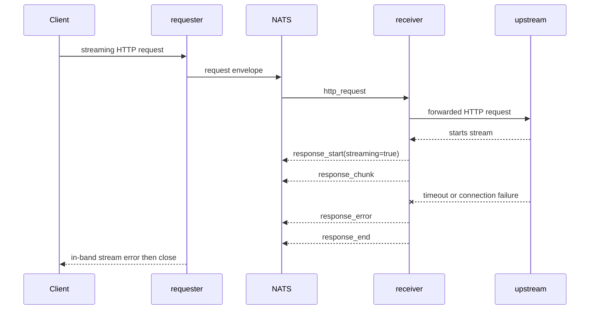

The bridge protocol is JSON-framed for HTTP work. Requester publishes a request envelope to a request subject and listens for response events on `reply_to`.

## Request Envelope

`BridgeProtocol.request_envelope` builds the envelope:

```json
{
  "type": "request",
  "request_id": "req-id",
  "reply_to": "from.proxy.responses.requester-service.req-id",
  "operation": "http_request",
  "payload": {
    "method": "GET",
    "path": "/path",
    "headers": {},
    "body": null
  }
}
```

Required fields are `request_id`, `reply_to`, `operation`, and `payload`. `BridgeCore` validates these fields before dispatching to a registered handler.

## Subjects

| Purpose | Pattern |
|---|---|
| Per-request work | `<NATS_REQUEST_SUBJECT_ROOT>.requests.<SERVICE_ID>.<request_id>` |
| Response events | `<NATS_RESPONSE_SUBJECT_ROOT>.responses.<SERVICE_ID>.<request_id>` |
| Receiver listen subject | `LISTEN_SUBJECT`, default `<request_root>.requests.>` |

## Response Events

| Event | Payload |
|---|---|
| `response_start` | HTTP `status`, normalized response `headers`, `content_type`, and `streaming`. |
| `response_chunk` | `body` for UTF-8 chunks, or `body_encoding=base64` and `body_base64` for binary chunks. |
| `response_error` | `error` string. Used for stream failures and cancellation diagnostics. |
| `response_end` | Terminal marker for an HTTP response. |

`text/event-stream` and `application/x-ndjson` responses are treated as streaming. Other responses are buffered until `response_end`.

## Non-Streaming Request



## Streaming Response



## Error During Stream



