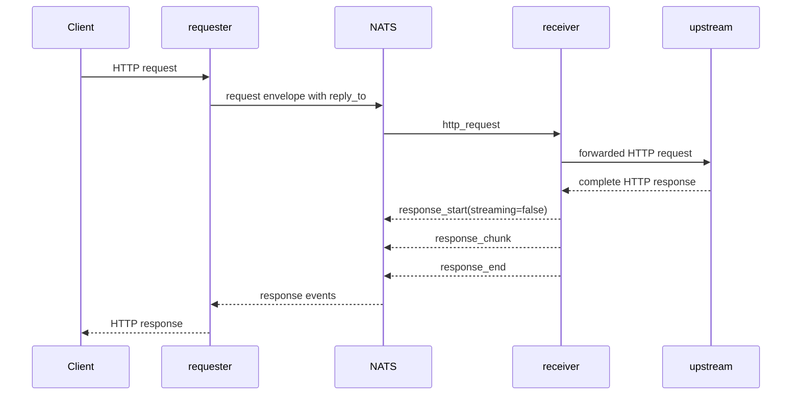
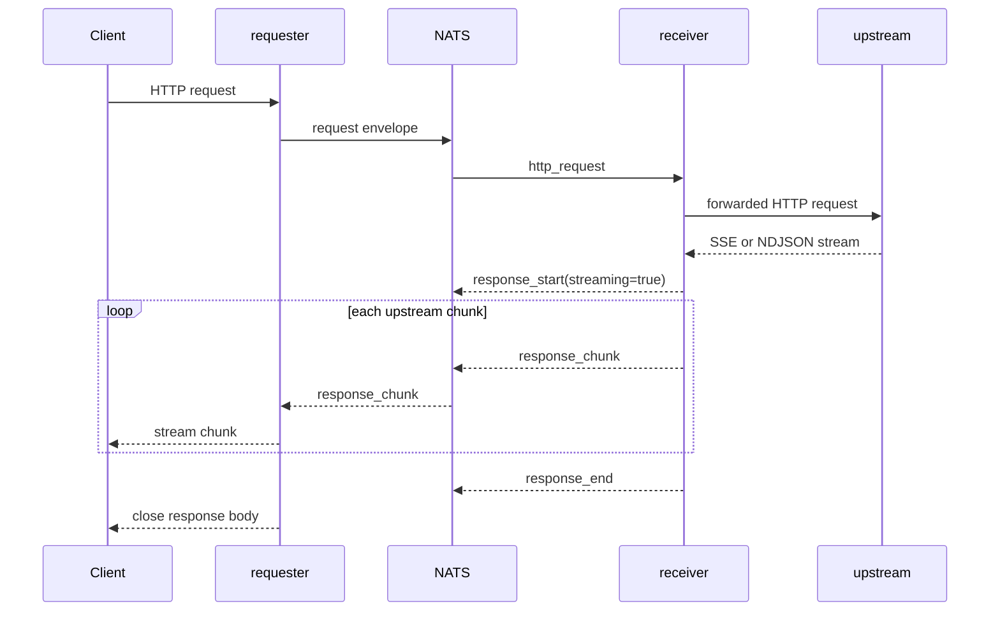
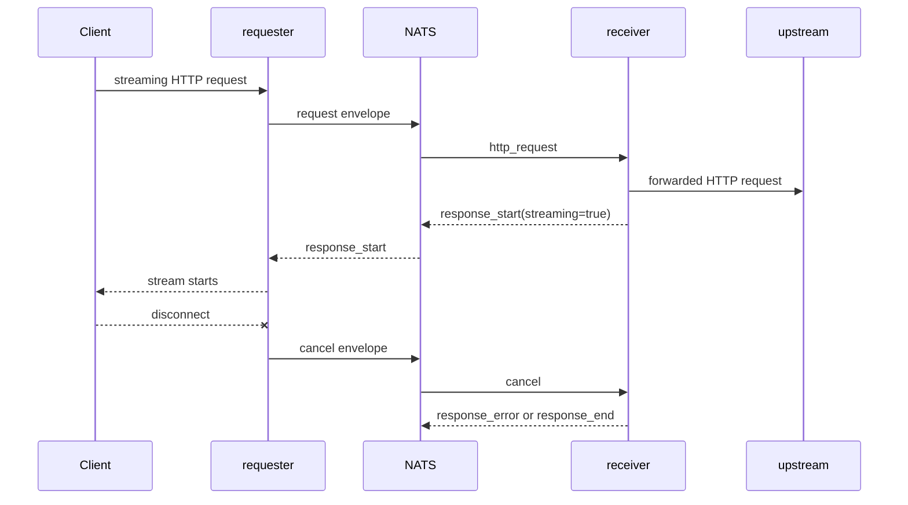

The bridge protocol is the message format used between the requester and receiver after a client request enters the bridge. Read this page when you need to understand what is sent through NATS, how responses come back, and how streams or tunnels are stopped.

HTTP work is JSON-framed. TCP tunnel data uses binary NATS frames after an initial JSON session open request.

For code-level debugging, the main implementation is split between `BridgeProtocol` and `BridgeCore`:

- `BridgeProtocol` builds and parses protocol objects.
- `BridgeCore` chooses subjects, publishes requests, validates envelopes, dispatches operation handlers, routes response events, and publishes cancellation envelopes.

## Operations

| Operation | Handler | Purpose |
|---|---|---|
| `http_request` | `HttpGateway#handle_bridge_request` | Forward an HTTP request to `UPSTREAM_URL` or to an absolute proxy target. |
| `tcp_stream` | `TcpTunnelBridge#handle_stream_request` | Open a TCP connection for HTTP `CONNECT` or SOCKS5 and then exchange binary session frames. |

Handlers are registered in `ServiceRuntime#boot!`. If a receiver gets an unknown operation, Core NATS mode publishes a controlled error response; JetStream mode raises so the message can be retried or terminated by the consumer path.

## Request Envelope

`BridgeProtocol.request_envelope` builds the JSON envelope sent by the requester:

```json
{
  "type": "request",
  "request_id": "req-id",
  "reply_to": "from.proxy.responses.requester-service.req-id",
  "operation": "http_request",
  "payload": {
    "method": "GET",
    "path": "/path",
    "headers": {},
    "body": null
  }
}
```

Required fields are `request_id`, `reply_to`, `operation`, and `payload`. `BridgeCore` validates these fields before dispatching to a registered handler.

For HTTP requests, `payload.path` can be:

- a normal origin-form path such as `/v1/models`, forwarded relative to `UPSTREAM_URL`;
- an absolute HTTP URL such as `http://example.com/path`, used by HTTP proxy traffic.

`HttpGateway` strips hop-by-hop request headers before forwarding. `GET` and `HEAD` do not send a request body. Other methods send the body as parsed JSON when possible, otherwise as a string.

## Response Events

HTTP responses are returned as ordered JSON events on `reply_to`.

| Event | Payload |
|---|---|
| `response_start` | HTTP `status`, normalized response `headers`, `content_type`, `streaming`, and owner metadata such as `receiver_service_id`, `request_id`, and `flow_kind`. |
| `response_chunk` | `body` for valid UTF-8 chunks, or `body_encoding=base64` and `body_base64` for binary chunks. |
| `response_error` | `error` string for stream failures or cancellation diagnostics. |
| `response_end` | Terminal marker for the HTTP response. |

`text/event-stream` and `application/x-ndjson` responses are treated as streaming. Other responses are buffered until `response_end`, then returned as a normal Rack response body.

## Owner Metadata

The first successful event of a flow selects the receiver that owns the rest of that flow.

- `response_start` carries `receiver_service_id`, `request_id`, and `flow_kind` for HTTP flows.
- `session_established` carries `receiver_service_id`, `session_id`, and `flow_kind` for TCP tunnel flows.

The requester stores this metadata in its request context. It is then used for owner-addressed cancellation and, for established TCP sessions, for upstream session bytes sent back to the receiver that opened the target connection.

## Non-Streaming Request



`BridgeProtocol.wait_for_start_event` waits up to `NATS_RESPONSE_TIMEOUT` for `response_start`. `BridgeProtocol.collect_non_streaming_body` then waits up to `STREAM_RESPONSE_TIMEOUT` for chunks and `response_end`.

## Streaming Response



For streaming responses, `HttpGateway` writes each chunk to the Rack stream as it arrives. Each wait for the next event uses `STREAM_RESPONSE_TIMEOUT`.

If the upstream fails after a stream has started, the receiver emits `response_error` followed by `response_end`. The requester writes an in-band error formatted for the stream content type:

- SSE: `event: error` with JSON data.
- NDJSON: one JSON error object followed by a newline.
- Other content types: a JSON error body.

## Cancellation

Cancellation is best effort. It is used when a downstream streaming client disconnects, a stream times out, or a tunnel writer fails. After owner selection, the requester publishes a cancel envelope to the owner-scoped subject `<request_root>.cancel.<receiver_service_id>.<request_id_or_session_id>`. Before the requester knows `receiver_service_id`, cancellation falls back to the original request subject as a best-effort early cancel.

```json
{
  "type": "cancel",
  "request_id": "req-id",
  "cancel": {
    "request_id": "req-id",
    "service_id": "requester-1",
    "reason": "downstream_disconnect",
    "timestamp": "2026-04-24T00:00:00Z"
  }
}
```

Receiver-side active streams observe this envelope through the owner-scoped cancel listener or through the early fallback path in the request listener. Duplicate or late cancels are ignored.

`RequestContext` allows a bounded trailing event after cancel. In the current code this is one `response_chunk`, plus a terminal `response_end` or `session_close` when present. This keeps cancellation from corrupting an already in-flight terminal event while still stopping further work as soon as the receiver sees the cancel.



Cancellation is best effort: late response events may already be in flight when the cancel envelope reaches the receiver.

For observability, request contexts store outcomes such as `completed`, `canceled`, `timeout`, `upstream_error`, `protocol_error`, and `session_error`. The case API derives user-facing outcomes from events: `success`, `error`, `timeout`, `canceled`, or `in_progress`.

## Binary Safety

`BridgeProtocol.chunk_event` sends response chunks as plain `body` only when the bytes are valid UTF-8. Invalid UTF-8 chunks are base64 encoded as `body_base64`. `BridgeProtocol.chunk_body` decodes both shapes on the requester side.

TCP tunnel payload bytes do not use JSON chunk events after the session is established. They are published as raw binary NATS payloads on session subjects.
