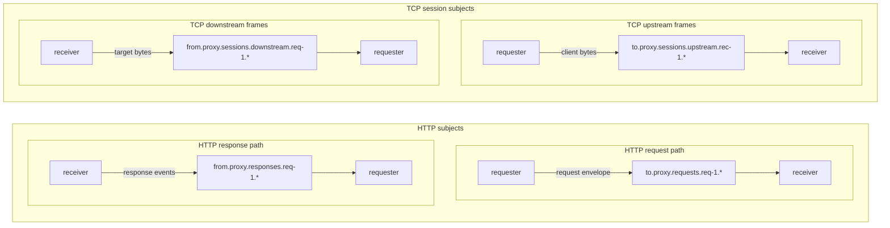

This page explains what the NATS layer carries between requester and receiver: request subjects, response subjects, TCP session subjects, and the difference between Core NATS and JetStream delivery.

`NatsAsyncRuntime` starts the `nats-async` client and resolves the backend from `NATS_MODE`. The resolved backend stays fixed for the process lifetime and is exposed through `/observability/nats`.

| `NATS_MODE` | Behavior |
|---|---|
| `core` | Uses Core NATS publish/subscribe. Receiver subscribes to `LISTEN_SUBJECT` with queue group `NATS_QUEUE_GROUP`. |
| `jetstream` | Publishes through JetStream and consumes through pull consumers on `NATS_STREAM`. |
| `auto` | Asks the NATS client to resolve the backend for `NATS_STREAM`; use `/observability/nats` to see the actual result. |

## Subject Model

The service uses two configurable roots:

- `NATS_REQUEST_SUBJECT_ROOT`, default `to.proxy`
- `NATS_RESPONSE_SUBJECT_ROOT`, default `from.proxy`

`SERVICE_ID` is embedded in request, response, session, and cancel subjects. NATS balances only the initial request or session-open message. After a receiver becomes the flow owner, the rest of that flow is addressed to the original requester and the selected receiver.

| Purpose | Pattern | Publisher | Consumer |
|---|---|---|---|
| Request envelope | `<request_root>.requests.<requester_service_id>.<request_id>` | requester | receiver request listener |
| Response event | `<response_root>.responses.<requester_service_id>.<request_id>` | receiver | requester response listener |
| Upstream TCP frame | `<request_root>.sessions.upstream.<receiver_service_id>.<session_id>` | requester | owner receiver upstream session listener |
| Downstream TCP frame | `<response_root>.sessions.downstream.<requester_service_id>.<session_id>` | receiver | requester downstream session listener |
| Owner cancel | `<request_root>.cancel.<receiver_service_id>.<request_id_or_session_id>` | requester | owner receiver cancel listener |

The default receiver listen subject is `to.proxy.requests.>`. Response, session, and cancel listeners subscribe to service-specific wildcard scopes derived from their role and `SERVICE_ID`.

## Core NATS

In Core NATS mode:

- request listener uses `subscribe(LISTEN_SUBJECT, queue: NATS_QUEUE_GROUP)`;
- response, session, and cancel listeners use plain wildcard subscriptions;
- messages are published as raw Core NATS payloads;
- invalid request envelopes can be answered directly with controlled response events.

Core NATS does not persist bridge messages. If no receiver is subscribed, the requester eventually times out while waiting for `response_start` or `session_established`.

## JetStream

In JetStream mode:

- request, response, session, and cancel listeners are pull consumers on `NATS_STREAM`;
- request processing uses durable consumer `NATS_CONSUMER_NAME` with explicit acknowledgements;
- the receiver dispatch queue is bounded by `RECEIVER_MAX_INFLIGHT` and internal `QUEUE_SIZE`;
- long-running receiver work sends `in_progress` heartbeats while the message is being handled.

Receiver request consumer settings are built in `BridgeCore#start_request_listener`:

| Setting | Current behavior |
|---|---|
| `ack_wait` | `max(NATS_RESPONSE_TIMEOUT, STREAM_RESPONSE_TIMEOUT) + 30` seconds |
| `max_ack_pending` | `200` |
| `max_waiting` | `20` |
| `max_deliver` | `3` |

Requester response and session consumers are service-specific:

| Listener | Consumer name |
|---|---|
| Response events | `<NATS_CONSUMER_NAME>-responses-<SERVICE_ID>` |
| Receiver upstream session frames | `<NATS_CONSUMER_NAME>-sessions-upstream-<SERVICE_ID>` |
| Requester downstream session frames | `<NATS_CONSUMER_NAME>-sessions-downstream-<SERVICE_ID>` |
| Receiver cancel envelopes | `<NATS_CONSUMER_NAME>-cancel-<SERVICE_ID>` |

Session-open messages for `tcp_stream` are acknowledged after `session_established` is emitted when possible. This prevents a long-lived tunnel from blocking the request consumer for the full tunnel lifetime.

For a multi-instance receiver pool, every live instance must have a unique `SERVICE_ID`. Core NATS receiver replicas that share work should use the same `LISTEN_SUBJECT` and `NATS_QUEUE_GROUP`; JetStream receiver replicas should share the same base `NATS_CONSUMER_NAME` for request work. Do not split Core and JetStream by message plane: `NATS_MODE` applies to request, response, session, and cancel traffic together.

## Embedded Stream Bootstrap

The Docker entrypoint bootstraps a JetStream stream only when all of these are true:

- `EMBEDDED_NATS_ENABLED=true`
- `SERVICE_ROLE=receiver`
- `NATS_MODE=jetstream`

The stream subjects are `<request_root>.>` and `<response_root>.>` unless both roots are the same. If both roots are equal, the entrypoint uses a single `<root>.>` subject.

Embedded NATS and leafnode behavior are deployment concerns; see [Embedded NATS](../deployment/embedded-nats/) and [Self-NATS Leafnodes](../deployment/self-nats-leafnodes/).
