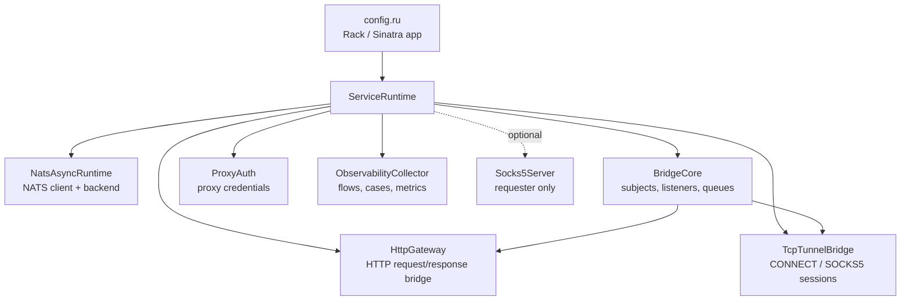
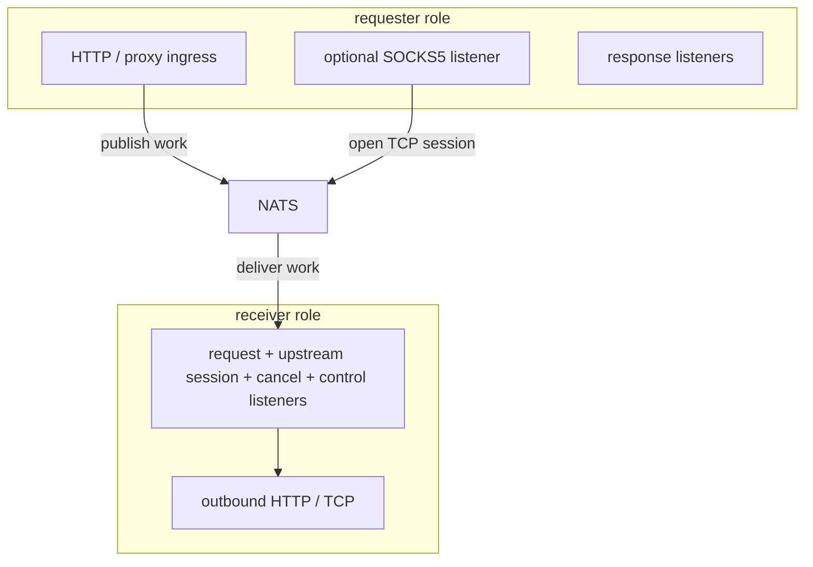

Architecture pages describe how the Ruby service is wired internally: which runtime components are created, which role starts which listeners, and where HTTP, TCP, NATS, and observability responsibilities live.

The architecture section is split by runtime boundary:

| Page | What it covers |
|---|---|
| [Bridge Protocol](bridge-protocol/) | JSON request envelopes, response events, stream framing, flow credit, and cancellation envelopes. |
| [NATS Transport](nats-transport/) | Core NATS vs JetStream behavior, subjects, listeners, and consumers. |
| [TCP Sessions](tcp-sessions/) | HTTP `CONNECT` and SOCKS5 tunnel sessions over NATS frame subjects. |

Stream and tunnel flow control and cancellation behavior is documented with [Bridge Protocol](bridge-protocol/), alongside the request and response events it uses.

## Runtime Composition

Runtime setup starts in `src/config.ru`. The Rack app resolves environment variables, builds `ProxyAuth`, creates `ServiceRuntime`, installs middleware, and exposes health, observability, and catch-all HTTP routes.

`ServiceRuntime#boot!` starts the NATS runtime, builds the bridge components, registers operation handlers, and then starts listeners for the configured role.

## Role Startup

Both roles are the same Ruby process with different listeners. `SERVICE_ROLE` is read from the environment; if it is not set, `config.ru` chooses `receiver` when `UPSTREAM_URL` exists and `requester` otherwise.

The requester also listens for responses and downstream TCP frames that return through NATS.

In the requester role, `BridgeCore` starts the response listener and downstream session listener. If `SOCKS5_ENABLED=true`, `ServiceRuntime` also starts `Socks5Server`.

In the receiver role, `BridgeCore` starts the request listener, upstream session listener, owner-scoped cancel listener, and owner-scoped control listener for HTTP response credit. HTTP requests are handled by `HttpGateway`; TCP sessions are handled by `TcpTunnelBridge`.

When more than one requester or receiver instance is running, `BridgeCore` uses `SERVICE_ID` to keep flow continuation scoped to the original requester and the selected receiver.

## Component Responsibilities

| Component | Responsibility |
|---|---|
| `NatsAsyncRuntime` | Starts the `nats-async` client, resolves `NATS_MODE` to `core` or `jetstream`, publishes messages, subscribes to subjects, and exposes connection snapshots. |
| `BridgeCore` | Owns subject naming, pending request contexts, receiver dispatch queue, response listeners, session frame routing, flow-credit frames, cancellation envelopes, and JetStream pull consumer handling. |
| `HttpGateway` | Converts Rack requests into `http_request` payloads, forwards receiver-side HTTP requests to `UPSTREAM_URL` or absolute proxy targets, and renders bridge events back into Rack responses. |
| `TcpTunnelBridge` | Opens `tcp_stream` sessions for HTTP `CONNECT` and SOCKS5, pumps binary frames in both directions, returns flow credit after socket writes, and closes sessions on flow timeout, disconnect, or target close. |
| `FlowCreditWindow` | Bounds bytes that may be published for streaming HTTP responses and TCP session directions until the consuming side returns credit. |
| `RequestContext` | Tracks per-request queues, streaming state, cancellation state, receiver service id, flow-credit windows, and final outcome. |
| `ObservabilityCollector` | Records bridge events and reconstructs flows, cases, metrics, and NATS runtime payloads for `/observability/*`. |

## Request Handling Shape

The Rack route layer does not contain bridge logic. It selects the correct local handler:

- `GET`, `HEAD`, `POST`, `PUT`, `PATCH`, `DELETE`, and `OPTIONS` routes call `HttpGateway#dispatch_http_request`.
- `CONNECT` is intercepted by `ConnectProxyMiddleware` and calls `TcpTunnelBridge#dispatch_connect_request`.
- The optional SOCKS5 listener accepts TCP clients outside Rack and calls the same `TcpTunnelBridge` session path.
- `/health`, `/healthcheck`, and `/observability/*` stay local unless the request is clearly proxy traffic.

This keeps the public HTTP surface small while the bridge behavior remains concentrated in `BridgeCore`, `HttpGateway`, and `TcpTunnelBridge`.
