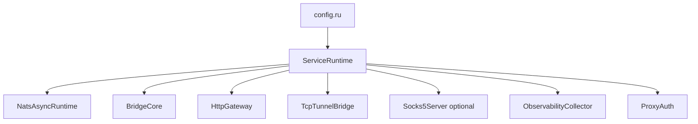

Runtime setup starts in `src/config.ru` and is composed by `ServiceRuntime`.

`BridgeCore` owns NATS subjects, pending request contexts, request dispatch, response listeners, session frame subjects, JetStream pull consumers, and cancellation envelopes.

`HttpGateway` converts Rack requests to `http_request` payloads and converts bridge response events back into Rack responses. It can also execute direct upstream calls when the process has `UPSTREAM_URL` and the outbound bridge is unavailable.

`TcpTunnelBridge` maps `CONNECT` and SOCKS5 sessions to a `tcp_stream` operation and binary session subjects.

