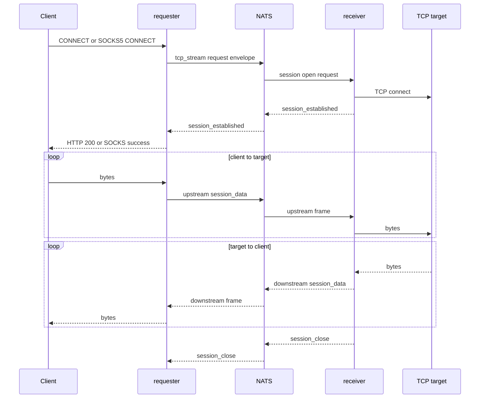

`CONNECT` and SOCKS5 both use the `tcp_stream` bridge operation. The requester opens a session, the receiver connects to the requested `host:port`, then binary frames move over session subjects.

## Session Open Payload

```json
{
  "operation": "tcp_stream",
  "payload": {
    "host": "example.internal",
    "port": 443,
    "ingress_kind": "http_connect",
    "method": "CONNECT",
    "requester_service_id": "requester-1"
  }
}
```

For SOCKS5, `ingress_kind` is `socks5` and `method` is `SOCKS5_CONNECT`.

## Flow



If the receiver cannot connect to the target, it emits a controlled bridge response with HTTP status `502` for the session open. If session establishment does not arrive before `NATS_RESPONSE_TIMEOUT`, requester returns a timeout to the caller.

Requester and receiver chunk size is capped by the NATS max payload and the local default chunk size of 32 KiB.

