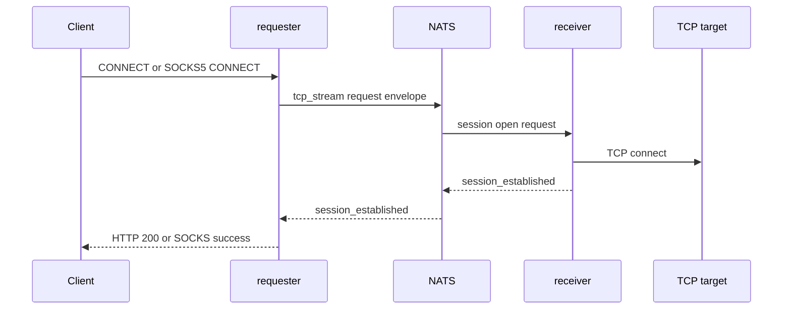
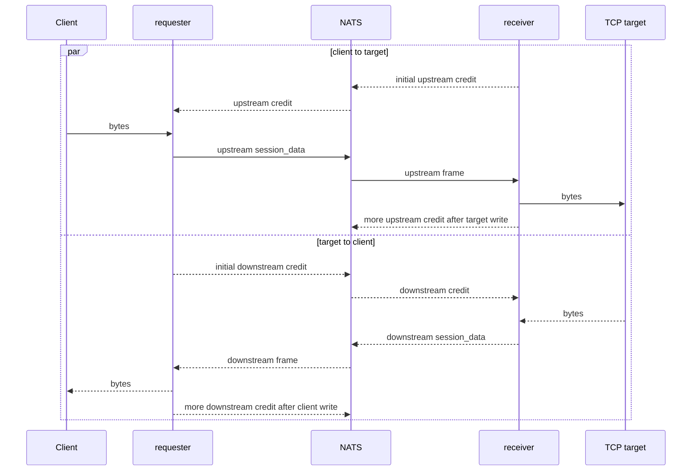
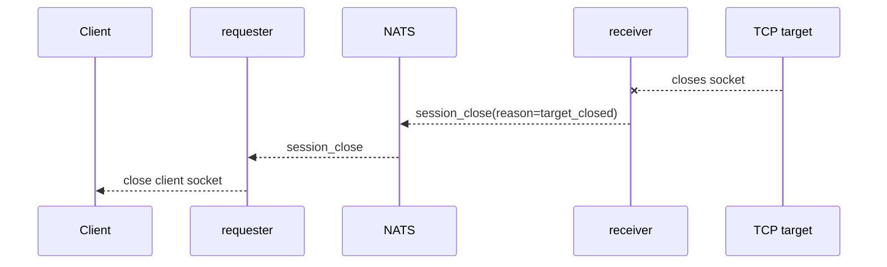

HTTP `CONNECT` and SOCKS5 are used when the caller needs a TCP tunnel instead of a normal HTTP request. In this mode the requester accepts the tunnel request, the receiver opens the real TCP connection, and bytes move through NATS in both directions.

Both ingress types use the `tcp_stream` bridge operation. The initial session open is a JSON request envelope. After the receiver connects to the requested `host:port`, tunnel bytes move as binary NATS messages on session subjects.

## Code Entry Points

The implementation lives in:

- `ConnectProxyMiddleware` in `config.ru` for Rack `CONNECT` interception;
- `Socks5Server` for optional SOCKS5 ingress;
- `TcpTunnelBridge` for session open, tunnel pumps, target connect, and close handling;
- `BridgeCore` for session subject naming and frame routing.

## Session Open Payload

The requester opens a tunnel by publishing a normal bridge request with operation `tcp_stream`:

```json
{
  "type": "request",
  "request_id": "session-id",
  "reply_to": "from.proxy.responses.requester-1.session-id",
  "operation": "tcp_stream",
  "payload": {
    "host": "example.internal",
    "port": 443,
    "ingress_kind": "http_connect",
    "method": "CONNECT",
    "requester_service_id": "requester-1"
  }
}
```

`requester_service_id` is added by `BridgeCore#bridge_session_open`. For SOCKS5, `ingress_kind` is `socks5` and `method` is `SOCKS5_CONNECT`.

The receiver validates `host`, `port`, `requester_service_id`, and the presence of an upstream session queue. If it cannot connect to the target, it emits a controlled bridge response with HTTP status `502` for the session open.

## Establishment Flow



`TcpTunnelBridge#dispatch_connect_request` waits up to `NATS_RESPONSE_TIMEOUT` for `session_established`. If it does not arrive, the requester returns a session establishment timeout.

`session_established` includes the receiver `SERVICE_ID` and the flow kind. The requester stores that owner id and uses it for all later upstream tunnel bytes and owner-scoped cancellation for the session.

HTTP `CONNECT` requires Rack hijack support. The provided runtime uses Falcon because the tunnel needs direct access to the client socket after the HTTP 200 response.

## Data Flow

Once established, both sides run reader and writer loops. Each direction is credit controlled: the side that wants to publish tunnel bytes must reserve credit first, and the receiving side returns credit after it successfully writes bytes to its local socket.



The frame subjects are documented in [NATS Transport](nats-transport/). After establishment, upstream bytes from the requester are published to the owner receiver scope, and downstream bytes from the receiver are published to the original requester scope. Session data messages carry `Nats-Session-Id` and `Nats-Frame-Type` headers. Downstream bytes are delivered to the requester's `RequestContext#tunnel_data_queue`.

Requester and receiver chunk size is capped by the smaller of half the NATS max payload and the local default chunk size of 32 KiB. With the default chunk size, each direction starts with a 1 MiB credit window and returns credit in 256 KiB batches after socket writes.

Session data and session credit share the same owner-scoped session subjects. `Nats-Frame-Type=session_data` and `session_data_downstream` carry bytes. `session_credit_upstream` and `session_credit_downstream` carry JSON `flow_credit` payloads.

## Close And Timeout

The tunnel closes when either side sees EOF, a write failure, a session close frame, cancellation, or a flow-credit wait timeout. An idle tunnel is allowed to stay open while both sockets remain open; it is not closed merely because no data frames arrive for `STREAM_RESPONSE_TIMEOUT`.



Current close reasons include:

| Reason | Where it is emitted |
|---|---|
| `client_closed` | Requester read loop reached EOF from the client. |
| `client_disconnected` | Requester read loop hit a socket error. |
| `target_closed` | Receiver target socket closed normally. |
| `cancel_requested` | Receiver observed cancellation while the session was active. |
| `flow_credit_timeout` | A reader could not reserve credit before the flow-credit wait timeout. |
| `hijack_not_supported` | Requester could not access Rack hijack for HTTP `CONNECT`. |

If the requester writer sees a `response_error`, it publishes cancellation with reason `upstream_error`. If the client disconnects while the requester is writing downstream bytes, it publishes cancellation with reason `downstream_disconnect`. Once the receiver owner is known, these cancels go to the owner receiver cancel subject.
