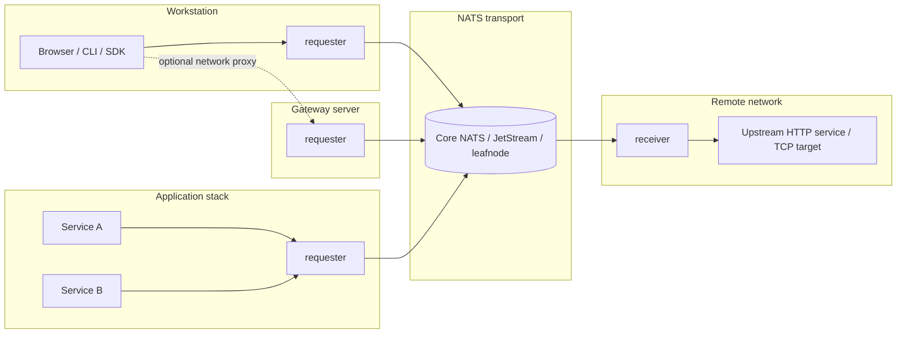
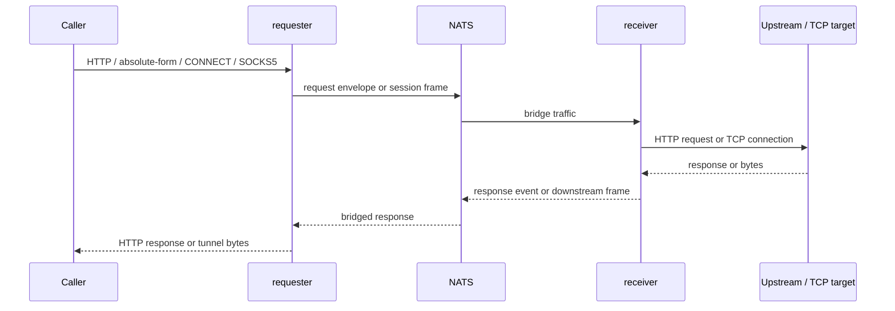

The requester should be placed where callers can use it as a local or nearby proxy. The receiver should be placed where the upstream service or TCP target is reachable.

## Requester Placement

| Placement | When it fits | Caller address |
|---|---|---|
| Workstation | Browser, CLI, SDK, or manual debugging from one machine | `127.0.0.1:<requester-port>` |
| Gateway server | Several clients share one proxy endpoint | Gateway host and published requester port |
| Application stack | Services in the same compose/Kubernetes network need egress through the bridge | Requester service DNS name |

## Traffic Flow

After a request reaches a requester, HTTP and TCP proxy traffic follow the same high-level path:

Only NATS has to be reachable between requester and receiver. The requester does not need direct network access to `UPSTREAM_URL`.

