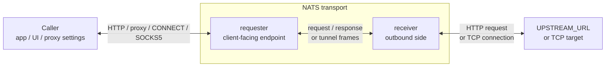

Topology is the deployment shape around the same bridge idea:

- callers must be able to reach the requester;
- the receiver must be able to reach the upstream HTTP service or requested TCP target;
- requester and receiver must both be able to reach NATS;
- direct network access between caller and upstream is not required.

## Placement Rule

| Component | Place it where... | It needs access to... |
|---|---|---|
| Caller | The application, UI, browser, SDK, CLI, or system proxy setting already runs. | The requester endpoint. |
| Requester | Callers can address it as an HTTP endpoint, HTTP proxy, or SOCKS5 proxy. | NATS. |
| Receiver | Outbound requests should be executed. | NATS and the required `UPSTREAM_URL` or TCP target. |
| NATS | Both sides can connect to it. | Requester and receiver clients. |

The requester can be local to a developer machine, inside an application stack, on a gateway server, or anywhere else that callers can reach. The receiver can run in a different network segment, on a host close to the upstream service, or near a TCP target. Those placement choices are deployment decisions; the bridge contract stays the same.

## High-Level Flow

The caller and target stay outside the NATS transport. Only requester and receiver have to share the NATS path.

## What Changes Between Topologies

Different deployments usually change only these things:

| Decision | Examples |
|---|---|
| Where callers find the requester | `127.0.0.1`, a compose service name, a gateway host, an internal load balancer. |
| How requester and receiver reach NATS | Shared NATS, external NATS, embedded NATS, JetStream, Core NATS, or leafnodes. |
| What the receiver can reach | A fixed `UPSTREAM_URL`, an absolute HTTP proxy target, or a TCP target requested by `CONNECT`/SOCKS5. |

Detailed run commands and deployment variants are documented in the deployment section. This page only describes the placement model.
