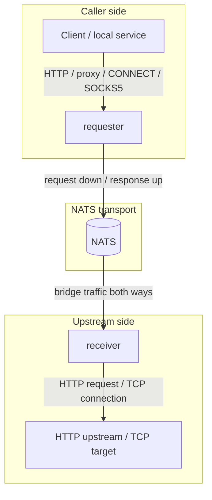

`nats-proxy` is a Ruby proxy gateway that moves HTTP and TCP proxy traffic through NATS.

It is built for split-network deployments: the caller can reach a local proxy, the target service is reachable only from another node, and the two sides can communicate through NATS.

## Concept

The service is a role-based proxy bridge. The requester is placed close to clients or local services. The receiver is placed close to the upstream system. The only required transport path between them is NATS.

One container image runs in one of two roles:

| Role | What it does |
|---|---|
| `requester` | Accepts local HTTP, HTTP proxy absolute-form requests, `CONNECT`, and optional SOCKS5 traffic. It publishes bridge requests to NATS and reconstructs responses for the client. |
| `receiver` | Consumes bridge requests from NATS, connects to `UPSTREAM_URL` or a requested TCP target, and publishes response or session events back to the requester. |



For detailed placement options, see [Topology](concepts/topology/). For supported caller traffic, see [Traffic Patterns](concepts/traffic-patterns/).

## Capabilities

- Plain HTTP forwarding through NATS.
- HTTP proxy absolute-form forwarding.
- HTTP `CONNECT` and optional SOCKS5 tunnels.
- Streaming HTTP responses for SSE and NDJSON.
- Core NATS and JetStream backends.
- Optional proxy authentication for proxy-specific ingress.
- Local observability UI and JSON APIs.

## Documentation Map

| Need | Page |
|---|---|
| Run it locally or in Docker | [Getting Started](getting-started/) |
| Understand roles and placement | [Roles](concepts/roles/) and [Topology](concepts/topology/) |
| Choose an ingress pattern | [Traffic Patterns](concepts/traffic-patterns/) |
| Configure the service | [Environment](configuration/environment/), [Proxy Auth](configuration/proxy-auth/), [SOCKS5](configuration/socks5/) |
| Understand internals | [Architecture Overview](architecture/overview/), [Bridge Protocol](architecture/bridge-protocol/), [NATS Transport](architecture/nats-transport/), [TCP Sessions](architecture/tcp-sessions/) |
| Deploy with NATS | [External NATS](deployment/external-nats/), [Embedded NATS](deployment/embedded-nats/), [Self-NATS Leafnodes](deployment/self-nats-leafnodes/) |
| Operate and debug | [Observability](operations/observability/), [Healthcheck](operations/healthcheck/), [Troubleshooting](operations/troubleshooting/) |
| Work on the codebase | [Local Dev](development/local-dev/), [Testing](development/testing/), [Code Map](development/code-map/) |

## Quick Start

The shortest local path is one NATS server, one receiver, and one requester:

```bash
# receiver
cd src
SERVICE_ROLE=receiver \
UPSTREAM_URL=http://127.0.0.1:8080 \
NATS_URL=nats://127.0.0.1:4222 \
NATS_MODE=core \
PORT=7001 \
bundle exec rackup -o 0.0.0.0 -p 7001 -s falcon
```

```bash
# requester
cd src
SERVICE_ROLE=requester \
NATS_URL=nats://127.0.0.1:4222 \
NATS_MODE=core \
PROXY_AUTH_ENABLED=false \
PORT=7000 \
bundle exec rackup -o 0.0.0.0 -p 7000 -s falcon
```

```bash
curl -fsS http://127.0.0.1:7000/healthcheck
curl -i http://127.0.0.1:7000/
```

See [Getting Started](getting-started/) for Docker, Compose, embedded NATS, and verification details.
