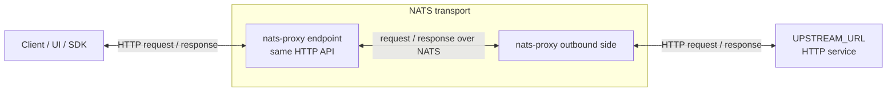
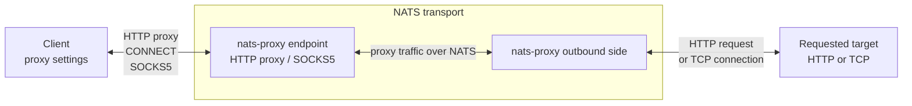

`nats-proxy` accepts regular HTTP/proxy requests from a client and carries them through NATS to another replica that performs the real outbound request.

It is useful when an application, SDK, browser, UI, or system proxy setting already knows how to talk HTTP, but you want NATS to be the transport between the client side and the required upstream. Instead of changing the client, you point it at a `nats-proxy` endpoint. The service accepts the request in its usual HTTP form, sends it through NATS to the upstream-facing side, that side performs an outbound HTTP request or opens a TCP connection, and the response returns through the same path.

The practical result is a bridge for software that does not natively speak NATS:

- Keep the same HTTP endpoint contract for the client.
- Move the actual request/response path through a NATS bus.
- Perform outbound requests from the upstream-facing side, where the required upstream or TCP target is reachable.
- Inspect recent requests, responses, stream events, tunnel sessions, and NATS runtime state from local observability endpoints.

## Main Scenarios

### Remote HTTP Endpoint

In this scenario, `nats-proxy` stands in front of a concrete HTTP upstream.

A client calls the client-facing endpoint as if it was calling the upstream service. That endpoint sends the HTTP method, path, headers, and body through NATS. The upstream-facing side makes the real HTTP request to `UPSTREAM_URL` and sends the response back. For the client, the endpoint still behaves like a regular HTTP API.

Use this when the client should keep the same HTTP API contract, while the actual upstream request must be made from the other side of NATS.

### Network Proxy

In this scenario, `nats-proxy` is configured as a normal HTTP proxy or SOCKS5 proxy, but the proxy traffic itself still goes through the NATS bus.

The client uses standard proxy support: an HTTP proxy URL, an HTTP `CONNECT` tunnel, system proxy settings, or the optional SOCKS5 listener. The client-facing endpoint accepts that proxy traffic and forwards it through NATS to the upstream-facing side. That side then opens the requested HTTP or TCP connection.

Use this when the client already supports HTTP proxy or SOCKS5 settings, and you need HTTP requests or TCP tunnels to cross the NATS bus.

## Roles

The same container image runs on both sides. The role only decides which side of the flow the container serves:

| Role | Responsibility |
|---|---|
| `requester` | Entry point for clients. Put this where applications, browsers, tools, or proxy settings can reach it. It accepts the client request and returns the final response. |
| `receiver` | Outbound side. Put this where the required `UPSTREAM_URL` or requested TCP target is reachable. It performs the real outbound request or connection. |

The client does not need to know about NATS. Between `requester` and `receiver`, the only required path is NATS.

You can run more than one requester or receiver. Requesters are the entry points chosen by your clients or platform, while receivers can form a worker pool on the outbound side.
NATS balances only the beginning of each request or tunnel session; after a receiver starts handling a flow, the rest of that flow is routed between the original requester and the selected receiver.

For role-specific behavior, see [Roles](concepts/roles/). For placement variants and topology details, see [Topology](concepts/topology/).

## What Clients Can Send

Clients can use the `nats-proxy` endpoint in these ways:

- Direct HTTP: the client calls `nats-proxy` like the upstream API; the outbound side forwards to `UPSTREAM_URL`.
- HTTP proxy: the client configures `nats-proxy` as an HTTP proxy; proxy traffic crosses NATS before the outbound request is made.
- HTTP `CONNECT`: the client opens a TCP tunnel through `nats-proxy`; the outbound side connects to the requested host and port.
- SOCKS5: optional proxy listener with the same NATS-backed TCP tunnel behavior.
- Streaming HTTP responses: SSE and NDJSON responses are returned as streams.

For technical details and examples for each pattern, see [Traffic Patterns](concepts/traffic-patterns/).

## Capabilities

- Core NATS and JetStream backends.
- Multi-instance requester/receiver topologies with receiver-balanced flow starts.
- Binary-safe chunk transport using base64 when a response chunk is not valid UTF-8.
- Best-effort stream cancellation when the downstream client disconnects.
- Local observability UI and JSON APIs for flows, cases, metrics, and NATS runtime state.
- Optional proxy authentication with bcrypt-hashed users for HTTP proxy, `CONNECT`, and SOCKS5 traffic.

## Documentation Map

| Need | Page |
|---|---|
| Start the service quickly with Docker | [Getting Started](getting-started/) |
| Understand roles and placement | [Roles](concepts/roles/) and [Topology](concepts/topology/) |
| Choose a client traffic pattern | [Traffic Patterns](concepts/traffic-patterns/) |
| Configure the service | [Environment](configuration/environment/), [Proxy Auth](configuration/proxy-auth/), [SOCKS5](configuration/socks5/) |
| Understand internals | [Architecture Overview](architecture/overview/), [Bridge Protocol](architecture/bridge-protocol/), [NATS Transport](architecture/nats-transport/), [TCP Sessions](architecture/tcp-sessions/) |
| Configure a deployment topology | [External NATS](deployment/external-nats/), [Embedded NATS](deployment/embedded-nats/), [Self-NATS Leafnodes](deployment/self-nats-leafnodes/) |
| Operate and debug | [Observability](operations/observability/), [Healthcheck](operations/healthcheck/), [Troubleshooting](operations/troubleshooting/) |
| Work on the codebase | [Local Dev](development/local-dev/), [Testing](development/testing/), [Code Map](development/code-map/) |

## Next Step

Use [Getting Started](getting-started/) to build the Docker image, start a local NATS-backed requester/receiver pair, and verify an HTTP request through the bridge.
